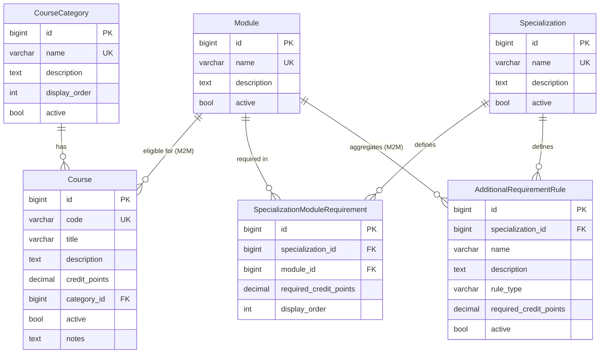

# Database Structure

This document describes the current database schema for **Kurs-Plan**, as defined by the Django models in `courses/` and `specializations/`. The `planner/` and `manage/` apps contain no database tables.

## Database engine

| Environment | Engine     | Location / notes        |
|-------------|------------|-------------------------|
| Development | SQLite 3   | `db.sqlite3` (project root) |
| Production  | PostgreSQL | Not yet configured in settings |

Django 6.0.5 manages schema via migrations. All application tables use a `BigAutoField` primary key named `id` unless noted otherwise.

---

## Entity-relationship overview

---

## Application tables

### `courses_coursecategory`

Django model: `courses.CourseCategory`  
Purpose: Groups courses for display on the student course-selection page.

| Column          | Type            | Constraints / default | Notes |
|-----------------|-----------------|----------------------|-------|
| `id`            | `BIGINT`        | PK, auto-increment   | |
| `name`          | `VARCHAR(255)`  | UNIQUE, NOT NULL     | |
| `description`   | `TEXT`          | NOT NULL, may be empty | `blank=True` |
| `display_order` | `INTEGER`       | NOT NULL, default `0`| Unsigned (`PositiveIntegerField`), UNIQUE (`unique_course_category_display_order`) |
| `active`        | `BOOLEAN`       | NOT NULL, default `true` | |

**Ordering:** `display_order`, then `name`.

---

### `courses_module`

Django model: `courses.Module`  
Purpose: Requirement area a course may count toward.

| Column        | Type           | Constraints / default | Notes |
|---------------|----------------|----------------------|-------|
| `id`          | `BIGINT`       | PK, auto-increment   | |
| `name`        | `VARCHAR(255)` | UNIQUE, NOT NULL     | |
| `description` | `TEXT`         | NOT NULL, may be empty | `blank=True` |
| `active`      | `BOOLEAN`      | NOT NULL, default `true` | |

**Ordering:** `name`.

---

### `courses_course`

Django model: `courses.Course`  
Purpose: A selectable teaching unit with credit value and module eligibility.

| Column          | Type            | Constraints / default | Notes |
|-----------------|-----------------|----------------------|-------|
| `id`            | `BIGINT`        | PK, auto-increment   | |
| `code`          | `VARCHAR(32)`   | UNIQUE, NOT NULL     | Course identifier |
| `title`         | `VARCHAR(255)`  | NOT NULL             | |
| `description`   | `TEXT`          | NOT NULL, may be empty | |
| `credit_points` | `DECIMAL(5,2)`  | NOT NULL             | Supports half credits (e.g. `4.50`) |
| `category_id`   | `BIGINT`        | FK → `courses_coursecategory.id`, NOT NULL | `on_delete=PROTECT` |
| `active`        | `BOOLEAN`       | NOT NULL, default `true` | |
| `notes`         | `TEXT`          | NOT NULL, may be empty | Admin-only notes |

**Ordering:** `code`.

**Relations:**

- **Many-to-one** → `courses_coursecategory` (`category_id`)
- **Many-to-many** → `courses_module` via `courses_course_modules` (see below)

---

### `courses_course_modules`

Django model: implicit M2M through-table for `Course.modules`  
Purpose: Records which modules a course can count toward.

| Column      | Type     | Constraints / default | Notes |
|-------------|----------|----------------------|-------|
| `id`        | `BIGINT` | PK, auto-increment   | |
| `course_id` | `BIGINT` | FK → `courses_course.id`, NOT NULL | `CASCADE` on course delete |
| `module_id` | `BIGINT` | FK → `courses_module.id`, NOT NULL | `CASCADE` on module delete |

**Unique constraint:** `(course_id, module_id)` — a course cannot be linked to the same module twice.

---

### `specializations_specialization`

Django model: `specializations.Specialization`  
Purpose: Target degree pathway whose requirements students check against.

| Column        | Type           | Constraints / default | Notes |
|---------------|----------------|----------------------|-------|
| `id`          | `BIGINT`       | PK, auto-increment   | |
| `name`        | `VARCHAR(255)` | UNIQUE, NOT NULL     | |
| `description` | `TEXT`         | NOT NULL, may be empty | |
| `active`      | `BOOLEAN`      | NOT NULL, default `true` | |

**Ordering:** `name`.

---

### `specializations_specializationmodulerequirement`

Django model: `specializations.SpecializationModuleRequirement`  
Purpose: Minimum credit points required in a specific module for a specialization.

| Column                   | Type           | Constraints / default | Notes |
|--------------------------|----------------|----------------------|-------|
| `id`                     | `BIGINT`       | PK, auto-increment   | |
| `specialization_id`      | `BIGINT`       | FK → `specializations_specialization.id`, NOT NULL | `on_delete=CASCADE` |
| `module_id`              | `BIGINT`       | FK → `courses_module.id`, NOT NULL | `on_delete=PROTECT` |
| `required_credit_points` | `DECIMAL(5,2)` | NOT NULL             | |
| `display_order`          | `INTEGER`      | NOT NULL, default `0`| Unsigned; controls evaluation/display order |

**Unique constraint:** `unique_specialization_module` on `(specialization_id, module_id)` — each module appears at most once per specialization.

**Ordering:** `specialization`, `display_order`, `module`.

---

### `specializations_additionalrequirementrule`

Django model: `specializations.AdditionalRequirementRule`  
Purpose: Cross-module requirement rules beyond per-module credit totals.

| Column                   | Type           | Constraints / default | Notes |
|--------------------------|----------------|----------------------|-------|
| `id`                     | `BIGINT`       | PK, auto-increment   | |
| `specialization_id`      | `BIGINT`       | FK → `specializations_specialization.id`, NOT NULL | `on_delete=CASCADE` |
| `name`                   | `VARCHAR(255)` | NOT NULL             | Short label for the rule |
| `description`            | `TEXT`         | NOT NULL, may be empty | |
| `rule_type`              | `VARCHAR(64)`  | NOT NULL             | See rule types below |
| `required_credit_points` | `DECIMAL(5,2)` | NOT NULL             | Threshold for the rule |
| `active`                 | `BOOLEAN`      | NOT NULL, default `true` | Inactive rules are ignored by the evaluator |

**Ordering:** `specialization`, `name`.

**Rule types** (`rule_type` choices):

| Value                              | Label                            |
|------------------------------------|----------------------------------|
| `minimum_credits_across_modules`   | Minimum credits across modules   |

**Relations:**

- **Many-to-many** → `courses_module` via `specializations_additionalrequirementrule_modules_included` (see below)

---

### `specializations_additionalrequirementrule_modules_included`

Django model: implicit M2M through-table for `AdditionalRequirementRule.modules_included`  
Purpose: Defines which modules contribute credit toward an additional rule (e.g. Methods + Statistics combined).

| Column                        | Type     | Constraints / default | Notes |
|-------------------------------|----------|----------------------|-------|
| `id`                          | `BIGINT` | PK, auto-increment   | |
| `additionalrequirementrule_id`| `BIGINT` | FK → `specializations_additionalrequirementrule.id`, NOT NULL | `CASCADE` on rule delete |
| `module_id`                   | `BIGINT` | FK → `courses_module.id`, NOT NULL | `CASCADE` on module delete |

**Unique constraint:** `(additionalrequirementrule_id, module_id)`.

---

## Referential integrity (`on_delete` behaviour)

| From table | FK column | To table | On delete |
|------------|-----------|----------|-----------|
| `courses_course` | `category_id` | `courses_coursecategory` | **PROTECT** — cannot delete a category that has courses |
| `specializations_specializationmodulerequirement` | `module_id` | `courses_module` | **PROTECT** — cannot delete a module referenced by a requirement |
| `specializations_specializationmodulerequirement` | `specialization_id` | `specializations_specialization` | **CASCADE** — deleting a specialization removes its module requirements |
| `specializations_additionalrequirementrule` | `specialization_id` | `specializations_specialization` | **CASCADE** — deleting a specialization removes its additional rules |
| M2M through-tables | `course_id` / `module_id` / `additionalrequirementrule_id` | parent rows | **CASCADE** — junction rows removed when either side is deleted |

---

## Django framework tables

Django creates and maintains additional tables for built-in functionality. These are not defined in application models but exist in the database:

| Table prefix | Purpose |
|--------------|---------|
| `auth_*` | User accounts, groups, and permissions (admin login) |
| `django_admin_log` | Django admin action history |
| `django_content_type` | Content-type registry for permissions |
| `django_migrations` | Applied migration tracking |
| `django_session` | Session storage for authenticated users |

Admin users authenticate via `auth_user` (`is_staff=True`). Student-facing checks do not persist selections to the database.

---

## Schema summary

| Table | App | Type |
|-------|-----|------|
| `courses_coursecategory` | `courses` | Entity |
| `courses_module` | `courses` | Entity |
| `courses_course` | `courses` | Entity |
| `courses_course_modules` | `courses` | Junction (Course ↔ Module) |
| `specializations_specialization` | `specializations` | Entity |
| `specializations_specializationmodulerequirement` | `specializations` | Entity (Specialization ↔ Module) |
| `specializations_additionalrequirementrule` | `specializations` | Entity |
| `specializations_additionalrequirementrule_modules_included` | `specializations` | Junction (Rule ↔ Module) |

**Total application tables:** 8 (6 entity tables + 2 junction tables).

---

## Migrations

Schema history (in apply order):

| Migration | Change |
|-----------|--------|
| `courses.0001_initial` | `CourseCategory` |
| `courses.0002_module` | `Module` |
| `courses.0003_course` | `Course` + M2M to `Module` |
| `courses.0004_coursecategory_display_order_unique` | Unique constraint on `CourseCategory.display_order` |
| `courses.0005_coursecategory_description` | `description` field on `CourseCategory` |
| `specializations.0001_initial` | `Specialization` |
| `specializations.0002_specializationmodulerequirement` | Per-module credit requirements |
| `specializations.0003_additionalrequirementrule` | Additional requirement rules |
| `specializations.0004_additionalrequirementrule_modules_included` | M2M `modules_included` on additional rules |

---

## Related documentation

- [SPEC.md](SPEC.md) — product requirements for each data object
- [DEVELOPMENT.md](DEVELOPMENT.md) — modeling and evaluation design decisions
- [README.md](README.md) — how stored data is used by the evaluation engine
